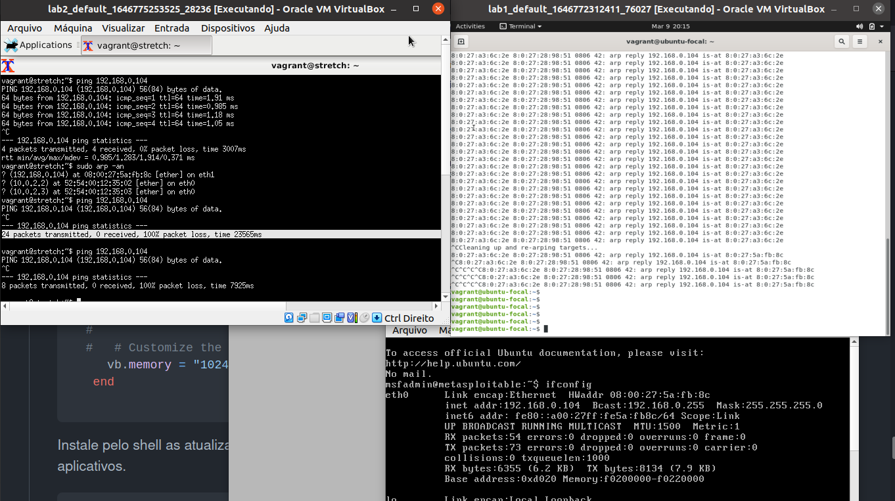
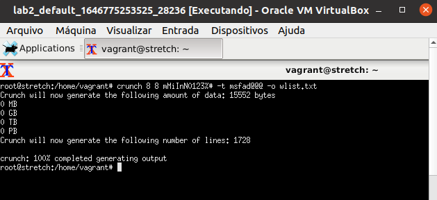
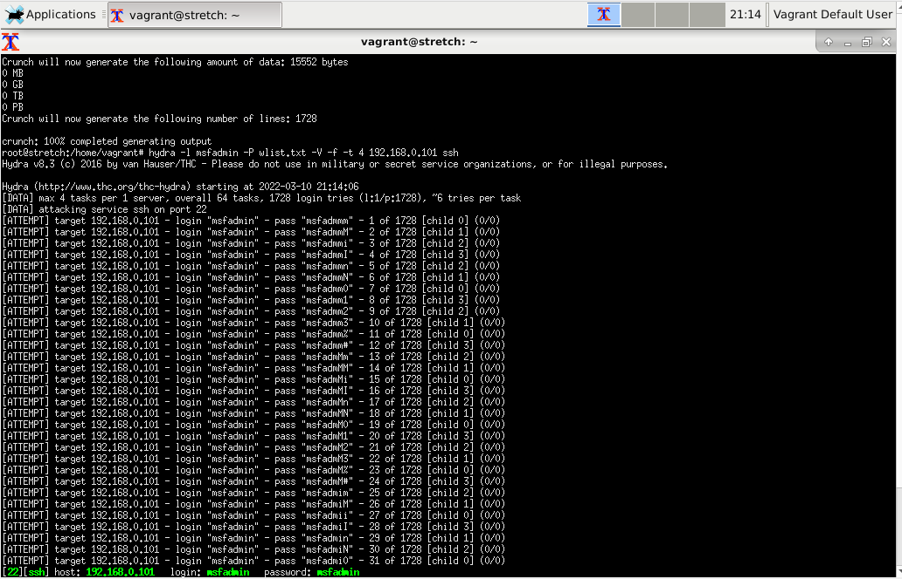
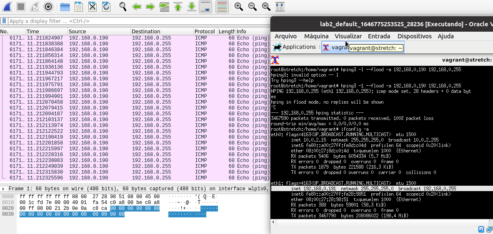
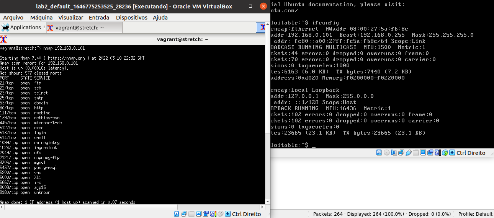
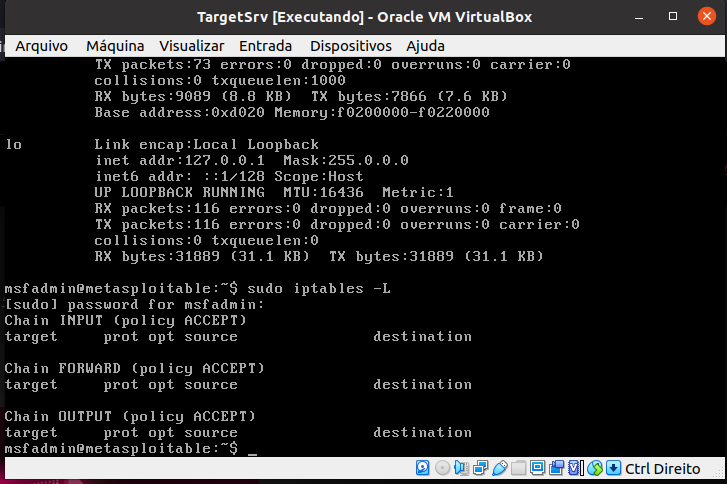
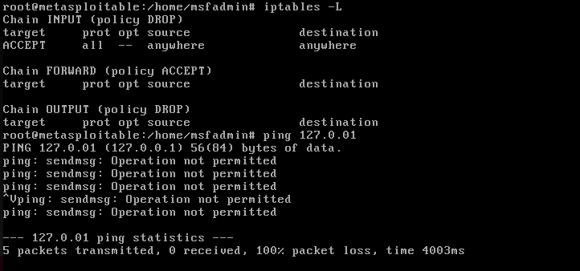
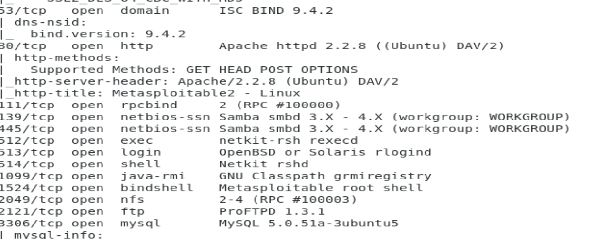

# Estudos sobre CYBERSECURITY.

Todo conteúdo é com base no curso CYBERSECURITY da fiap.
```html
https://on.fiap.com.br
```
# CAPITULO 1

## Definições.

Cybersecurity abrange um conjunto de normas, procedimento e boas práticas, que ajudam na identificação e mitigação de riscos relacionados a exposições na internet.  

## Vetores de ataque.

Vetor é o motivação ou o meio em qual ocorreu o ataque, os principais são listados a seguir.

## Principais Incidentes Reportados.


- PHISHING: email ou informação falsa compartilhada por meio digital. Maneira de atrair o alvo.

- WORM: atividades maliciosas relacionadas com processo automatizado da propagação de códigos maliciosos na rede.

- BRUTE FORCE: teste de varias possiveis senhas para acesso as credenciais do usuario.

- Dos: Denial of Service, onde o atacante utiliza um computador ou um conjunto de computadores para tirar de operação um serviço, computador ou rede.

- Invasão: Um ataque por acesso não autorizado a um computador ou rede.

- WEB: Ataque que compromete servidores web ou desconfigura páginas web.

- SCAN: analise da rede, por varredura de portas para identificar potenciais alvos.

- FRAUDE: qualquer ato de má fé com o objetivo de lesar ou ludibriar alguem. Enganar.


## Processos Internos.

Todo o levantamento de ativos da empresa para mapeamento de informações é muito importante. Impactando diretamente em processos internos específicos e simples da empresa, como quem tem acesso a informação, a necessidade daquele acesso para tal, o privilegio de acesso do usuario e a politica de segurança que a empresa propaga para evitar ou até mitigar riscos, tratando não apenas os efeitos mas as causas que levaram ao ataque.


# CAPITULO 2

## Segurança da Informação.

Definir a segurança da informação em uma só coisa é complicado, digamos que não se resume somente a equipamentos tecnologicos mas tambem processos, pessoas, ferramentas e documentos que regem toda uma area de mercado vasta.

> A segurança da informação pode ser definida como a proteção da informação contra diferentes tipos de ameaças, com o objetivo de garantir a continuidade do negócio, minimizar os riscos aos quais este possa vir a ser exposto. (ISO/IEC 27002:2005)

> A referida proteção da informação pode ser inicialmente entendida como a preservação da confidencialidade, integridade e disponibilidade da informação, essas propriedades complementadas a autenticidade, responsabilidade, não repúdio e confiabilidade, tornam completos todos os pilares da segurança da informação. (ISO/IEC 27001:2005)


**If you think technology can solve your security problems, then you don't understand the problems and you don't understand the technology.**

Não se investe em segurança da informação calculando o retorno (ROI- Return Over Investment), mas sim em quanto se consegue economizar, minimizando os riscos aos quais os ativos da organização possam vir a ser expostos, sem obter benefícios, então dá-se ao negocio o calculo de quanto o investimento pode evitar a perda de dinheiro.

### CID (confidencialidade, integridade e disponibilidade).

Três pilares básicos da Segurança da Informação.

- Confidencialidade: significa que esta acessível unicamente aos que tem autorização para isso.

- Integridade: garante exatidão e plenitude da informação, oque ão garante alterações ao longo do ciclo de vida da informação mas sim as que sejam legítimas.

- Disponibilidade: deve estar acessível a informação quando necessária, aos que tiverem autorização para isso.


### Privilégios minimos (Least Privilege)

A segurança da informação envolve muitos processos, entre os citados a **manutenção de privilégios mínimos** é o enfoque deste capitulo, que é a garantia de que um usuario comum não tenha privilégios semelhantes ao de um administrador.


### Defesa em profundidade (Defense in depth)

A defesa em profundidade é a implementação de um sistema defensivo em forma de camadas, onde varios mecanismos se complementam promovendo o sistema como um todo. 


### Principio da simplicidade (KISS - Keep it Sample, Stupid)

Um principio de que não se deve complitar a situação, que seja sucinto e simples. 

É necessario sempre partir de um script, o ponto inicial para configurações de firewalls ou redes. 

### Segregações de funções. (Separation of duties - SoD)

Método clássico para resolução de conflitos com o foco de previnir fraudes, sempre fazendo com que mais uma pessoa seja necessária para conclusão de uma tarefa. 

> "Implementar uma separação de papéis e responsabilidades que reduza a possibilidade de um único individuo 


# CAPITULO 3
## Riscos, vulnerabilidades e ameaças à segurança da informação e á continuidade de negócio. 

### Risco.

O termo RISCO é definido como qualquer evento que possa ter impacto (negativo) sobre a capacidade do serviço.

### Ameaças.

>Ameaças são definidas como a causa potencial de um incidente indesejado, que pode resultar em dano para um sistema ou para a organização.ISO/IEC13335-1:2004

### Vulnerabilidades

É definida uma vulnerabilidade como uma fraqueza em um sistema, deixando suscetíveis a incontáveis atividades que poderão causar perdas ou danos. 

## CVE (Common Vulnerability and Exposures).

Site especializado que padroniza as vulnerabilidades, fornecendo metricas, descrições e informações sobre vulnerabilidades ou exposições de informações de softwares por meio de um numero. 


```html
https://cve.mitre.org/
```
## Ataques e vetores de ataque.

Lembrando que um vetor de ataque é um caminho ou meio utilizado por um ser malicioso para obter acesso não autorizado, como um sistema ou dispositivo. 

- Ataques via browser; (20%) Violaçã por meio de navegador. 
- Ataques por força bruta; (20%) Teste de tentativa e erro.
- Ataques de negação de serviço; (15%) Ataques de sobrecarga de serviço.
- Ataques por worms; (13%) código malicioso que se auto-propaga. 
- Ataques por malwares; (10%) Código malicioso criado para prejudicar, sequestrar ou espionar. 
- Ataques web; (4%) SQL Injection, ataque direcionado a serviços web.
- Varreduras (scan attacks); (4%) Analise de portas abertas. hosts 
- Insiders. (14%) ataques realizado por um objetivo,planejamento e normalmente bem orquestrados. 

#### IDS (Sistema de identificação de intrusos)

## Controles para mitigação de riscos cibernéticos. 

CIS - Center Internet Security (Centro de estudos sobre segurança da internet), onde há um guia de adequação de controles de mitigação de riscos. Com 20 implementações sugestivas.

```html
https://www.cisecurity.org/
```

As principais implementações sugeridas pela CIS são:

- Inventário de dispositivos autorizados e não autorizados.
- Inventário de softwares autorizados e não autorizados.
- Implementação e gerenciamento da configuração segura dos ativos.
- Processos para avaliação e remediação continuada de vulnerabilidades. 
- Uso apropriado de privilégios administrativos.

Uma boa ferramenta para **inventário** é a **OCS inventory**, disponivel em:

```html
https://ocsinventory-ng.org/?lang=en 
```
> Desde 2001, o OCS Inventory procura tornar o inventário de hardware e software de computadores mais eficiente. O OCS Inventory consulta seus agentes para conhecer a composição soft e hard de cada máquina, de cada servidor.

Tambem se torna importante adquirir um SCAP (Security Content Automation Protocol), com maior dificuldade de aplicação, se torna vantajoso para auxiliar no planejamento e execução de varreduras de vulnerabilidades de forma automatizada e periodica. 

# CAPITULO 4

## TCP/IP: principais caracteristicas, funcionamento e vulnerabilidade.

#### Arpanet 

Em 1969 a Advanced Research Projects Agency (ARPA) desenvolveu uma rede experimental comutada por pacotes, chamada arpanet, estudando a comunicação de dados de forma segura. 

#### TCP/IP


A suíte de protocolos TCP/IP é baseada em
um modelo (de rede) com quatro camadas, diferente do modelo OSI que possui sete camadas – são diferentes.
O TCP foi adotado como padrão militar em 1983.

Modelo OSI | Modelo TCP/IP
:-----------:|:-----------------:
Aplicação | Aplicação: abrange as camadas de SESSÃO, APRESENTAÇÃO e APLICAÇÃO do modelo OSI.
Apresentação | 
Sessão | 
Transporte | Transporte: equivale à camada de TRANSPORTE do modelo OSI.
Rede | Internet: equivale à camada de REDES do modelo OSI.
Enlace | Acesso à rede: também algumas vezes referenciada simplesmente como camada de REDE, abrange as camadas FÍSICA e de Enlace do modelo OSI.
Física | 


#### Cabeçalho IPV4
Campo | Responsabilidade 
:-------------: | :-------------------------------------:
Version | Versão : Onde se define se é um ipv6 ou ipv4.
Protocol | Ip protocol. 1 ICMP, 2 IGMP, 6 TCP, 17 UDP.
Fragment Offset | Fragmentação de pacotes,  campo de 13 bits.
IP Flags | Dont Fragment or M More fragments follow.
Header Length | campo de 4 btis 
Total Length | campo de 16 bits 
Header Checksum | Campo que verifica a consistência do cabeçalho. 
RFC 791 | Internet Protocol 


#### Protocolo ICMP (Internet Control Message Protocol).

Usado para troca de diferente tipos de informação entre dispositivos IP em uma inter-rede. 


O corpo do comando PING funciona no seguinte padrão com o protocolo ICMP. 
Campo | Função
 :-------------:|:--------------------------------------------:|
 Type | campo com 8 bits que identifica o tipo de mensagem.
 Code | campo com 8 bits que identifica o subtipo da mensagem.
 Checksum | campo com 16 bits para verificar a consistência da mensagem. 
 Message Body | campo de tamanha variavel destinado a mensagens de erro ou informação.
 
#### TCP/IP: camada de transporte.

A camada de transporte  é a responsavel pela comunicação entre processos finais. Ou seja de ponta a ponta. a entrega fim-a-fim não se limita apenas à entrega da mensagem de um computador a outro, mas também de um processo específico no computador de origem a um processo específico no computador de
destino.

- TCP: (Transmistion Control Protocol) protocolo de comunicação confiavel e seguro que garante a entrega da mensagem, pois possui confirmação de recebimento, é orientado à conexão.

Estado do TCP | Significado
:------------:|:-----------------------------------------------:
CLOSED	| condição que não há conexão entre dispositivo
LISTEN | um dispositivo aguarda uma mensagem de sincronização.
SYS-SENT | após a mensagem de sincronização este aguardando resposta do outro dispositivo.
ESTABLISHED |  ambos os dispositivos receberam uma solicitação de conexão.
CLOSE WAIT | um dos dispositivos recebeu do outro um pedido de encerramento da conexão.
LAST ACK | o dispositivo que recebeu o pedido de encerramento e já o confirmou enviou seu próprio FIN e está aguardando um ACK para sua requisição.
FIN WAIT | um dispositivo neste estado está aguardando um ACK para um FIN que enviou ou aguarda por uma solicitação de finalização de conexão originada pelo outro dispositivo.
CLOSING | o dispositivo recebeu um FIN do outro dispositivo e enviou a ele um ACK, mas ainda não recebeu um ACK para sua própria mensagem FIN.
- UDP (User Datagram Protocol) protocolo simples, utilizado para transporte de pacotes sem conexão, não requer confirmação de recebimento.

## TCP/IP: camada de aplicação.

É a camada onde existe aplicações ouvindo para dispor de serviços, estão ligadas a protocolos.


APLICAÇÃO | TRANSPORTE | PORTA | DESCRIÇÃO 
:-----:|:---------:|:---:|:--------------------------------------------:
SSH|TCP|22| Acesso remoto seguro (criptografado)
TELNET|TCP|23| Acesso remoto sem criptografia
SMTP|TCP|25|Transferencia de email entre servidor e cliente.
DNS|UDP/TCP|53| Resolução de nomes.
DHCP|UDP|67/68|Endereçamento dinâmico de hosts.
HTTP|TCP|80|Navegação web.
POP|TCP|110|Recebimento de emails.
NTP|UDP|123|Sincronização de relogios dos hosts em uma rede. 

Ferramenta: netstat: verifica o status da rede. 

# CAPITULO 5 - Hypervisor (Laboratorio).

## Instalação do Virtual Box.

O virtual Box é um Hypervisor destinado a criação e o gerenciamento de máquinas virtuais. 

Faça o download do pacote conforme seu sistema operacional local no site oficial:

```html
https://www.virtualbox.org/wiki/Downloads
```

Use o comando dentro da pasta que fez o Download do arquivo de instalação.

```bash
sudo dpkg -i nomedopacote.deb
```

Lembre-se da configuração se estiver usando linux.

```bash
sudo /sbin/vboxconfig
```


Não esqueça de instalar o extension pack.

## Instalação do Vagrant.

O curso orienta o download de uma iso de um debian, porem eu acho mais facil a criação de uma maquina com o vangrant. 

No site do vagrant selecione seu sistema operacional e instale a ferramenta.

```html
https://www.vagrantup.com/downloads 
```

Procure por debian stretch64, e em um diretorio novo no terminal, rode os comandos:

```bash
vagrant init debian/stretch64
vagrant up
```

Edite no Vagrantfile as informações:

>
```sh
config.vm.provider "virtualbox" do |vb|  # Display the VirtualBox GUI when booting the machine  vb.gui = true  # Customize the amount of memory on the VM vb.memory = "1024" end
```

Use o comando vagrant provision para subir as mudanças. 

# CAPITULO 6

## Análise de pacotes em redes TCP/IP.

São aplicativos que analisam o tráfego, os dados, os pacotes especificamente, com base em cada camadas do modelo OSI estudados anteriormente. 

- Verificar o tráfego gerado por protocolo.
- Verificar a existência de gargalos na rede. 
- Correlacionar eventos. 
- Detectar intrusões. 
- Implementar políticas de segurança. 


### FTP. 

FTP significa File Transfer Protocol, um termo em inglês cuja tradução é Protocolo de Transferência de Arquivos.


Estabelecedor de conexão via dispositivo entre usuário e servidor, por meio dele é possivel realizar a troca de dados, quando devidamente conectados, funcionando por meio de um programa que conecta dois agentes: 


- cliente: quem solicita o acesso aos dados; 
- servidor: armazenador de informações.

Para instalar o vsFTPD no debian, no terminal, use o comando :
```bash
apt-get install -y vsftpd
```

Verifique se o serviço esta ativo com o comando:
```bash
sudo systemctl status vsftpd
```

Use o ftp da seguinte forma:

```bash
ftp 192.168.0.200
```


### TCP-DUMP. 

Monitoramento de rede, visualização por console ações que passam pela interface de rede. 


Para instalar em sua máquina use o comando:

```bash
sudo apt install tcpdump 
```

Atualize o repositorio.

```bash
sudo apt update 
sudo apt upgrade
```

Com o comando tcpdump -D é possivel visualizar as interfaces de rede ativas.

```bash
tcpdump -D
```
Para utilizar o tcpdump, lembrando que ele é via terminal, use o comando seguido pelo ip da máquina que esta na rede e deseja se conectar, lembre que o usuario e senha é do ip que deseja se conectar. 

```bash
tcpdump 192.168.0.101
```


E para setar qual interface deseja utilizar use o comando:

```bash
tcpdump -i eth1
```

Para ver oque esta sendo transmitido na rede no momento, use o parametro verbose -v :
```bash
tcpdump -i eth1 -v
```


Para mudar o nome de dominio para ip use o parametro -n:

```bash
tcpdump -i eth1 -n
```

Para armazenar os dados em um arquivo .pcap, use o parametro -w:

```bash
tcpdump -i eth1 -v -w nome.pcap 
```

### Wireshark 

O Wireshark, por sua vez, é um dos aplicativos mais completos e amplamente utilizados para análise de protocolos. Dispõe de interface gráfica simples e adequadamente configurável, sendo capaz de capturar os pacotes a serem analisados, ou extraí-los de arquivos no formato pcap, como os gerados pelo TCPDump.


```bash
sudo apt-get install wireshark 
```

Para capturar pacotes desta vez vamos utilizar o apache, porta 80:

```bash 
sudo apt install apache2
sudo service apache2 start
```

Depois inicialize o wireshark no terminal. 

```bash
wireshark
```

Inicie a captura na interface correta a esquerda.


Pingue do cliente ao servidor e verifique os pacotes sendo trocados por protocolo http.


# CAPITULO 7

## ATAQUES EM REDES TCP/IP.


- Ataques passivos ou de reconhecimento: são processos simples com o objetivo de coletar informações sobre sistemas e serviços em execução na rede. Senhas, servidores disponiveis, hashes de senha e enndereços IPS, são algumas das informações coletadas neste tipo de ataque. 

- Ataques ativos ou de comprometimento: são ataques que interferem no funcionamento dos sistemas e serviços, prejudicando usuarios ou dispositivos de rede. 

- Ataques de paralisação ou negação de serviço: são os que tem como foco desabilitar ou impedir o funcionamento do sistema que esta em produção. DoS (Denial of Service), ou DDoS (Distributed Denial of Service). 

### Simulando um ataque de Negação de serviço (DoS) com base no protocolo ARP Cache Poisoning. 

Este ataque ocorre quando um atacante manipula a tabela ARP do sistema alvo, ou seja altera as informações de destino dos pacotes. 

Eu usei o vagrant para criar duas máquinas, um debian e um ubuntu que são os clientes. Usei o metasploitable como servidor.

- lab1 (Ubuntu) - 192.168.0.198 CLIENTE ATACANTE
- lab2 (Debian) - 192.168.0.191 CLIENTE ALVO
- Metasploitable (Ubuntu)  - 192.168.0.104 SERVIDOR

### Criando um ubuntu com vagrant. 

Crie o diretorio lab1 baixe um arquivo de configuração de um ubuntu/focal64, com o comando:

```bash
mkdir lab1
vagrant init ubuntu/focal64
```

Antes de iniciar é interessante alterar o IP, dependendo da sua rede no Vagrantfile que agora há na pasta lab1.

Para ter uma interface gráfica descomente as linhas:

```ruby
 config.vm.provider "virtualbox" do |vb|
  #   # Display the VirtualBox GUI when booting the machine
     vb.gui = true
  #
  #   # Customize the amount of memory on the VM:
     vb.memory = "1024"
   end
   
```

Instale pelo shell as atualizações que deseja, descomente as linhas e adicione aplicativos.

```ruby
  config.vm.provision "shell", inline: <<-SHELL
     apt-get update
     apt-get install -y xfce4 firefox apache2 -y
   SHELL
end
```

Para iniciar a máquina:

```bash
vagrant up
```
> usuario/senha : vagrant

### Criando um debian com vagrant. 

Crie a pasta lab2, baixe o arquivo de configuração do debian/stretch64 pelo terminal.

```bash
mkdir lab2
vagrant init debian/stretch64 
```


Antes de iniciar é interessante alterar o IP, dependendo da sua rede no Vagrantfile que agora há na pasta lab1.

Para ter uma interface gráfica descomente as linhas:

```ruby
 config.vm.provider "virtualbox" do |vb|
  #   # Display the VirtualBox GUI when booting the machine
     vb.gui = true
  #
  #   # Customize the amount of memory on the VM:
     vb.memory = "1024"
   end
   
```

Instale pelo shell as atualizações que deseja, descomente as linhas e adicione aplicativos.

```ruby
  config.vm.provision "shell", inline: <<-SHELL
     apt-get update
     apt-get install -y xfce4 firefox apache2 -y
   SHELL
end
```


Para iniciar a máquina:

```bash
vagrant up
```

> usuario/senha : vagrant


### Instalação da Metasploitable com o virtualbox.

Baixe a imagem pelo site:

```bash
https://sourceforge.net/projects/metasploitable/files/Metasploita-
ble2/
```

Descompacte o arquivo com o comando:

```bash
unzip nomedoarquivo.zip
```

Crie a pasta lab3 e coloque todos os arquivos descompactados na nova pasta. 

Abra o virtualbox e crie uma nova máquina linux, ubuntu 64 bits. 
Memoria da forma que o virtualbox indica, selecione o arquivo vmdk na pasta nova e selecione para criar. 

Pode precisar alterar a placa de rede de NAT para bridge nas configurações em rede. 

### Testando a conectivadade das máquinas.

Com o servidor pingue as outras duas para verificar a comunicação.


### Ataque de envenenamento de pacotes.

Depois disso instale o dnsiff no atacante (Ubuntu) com os comandos :

```bash 
apt-get update
apt-get install -y dsniff
arp -na 
```
Teste o comando arp -na para verificar o atual mapeamento entre os endereços da rede. 

```bash
arp -na
```
Agora repare no mac atual do servidor Metasploitable quando recebe o ping do debian cliente, é um mac e depois do ataque de envenenamento de pacotes com o Ubuntu atacante, muda o mac do servidor tornando assim o atacante o emissor de pacotes. 


```bash
sudo arpsoof -i enpOs8 -t 192.168.0.191 192.168.0.104 
```

Repita o comando arp no debian. 


### Ataque de negação de serviço. 


Lembrando que é possivel verificar tambem durante o ataque de envenenamento de pacotes a negação do serviço de comunicação pelo protocolo ICMP, já que esta redirecionado a comunicação do atacante. 


Conforme a imagem. A comunicação entre debian cliente e servidor metasploitable não ocorre. 





### Ataque man in the middle. (Homem no meio)

Interceptar envio de pacotes (username e password) em uma rede local.

No ubuntu atacante, instale o wireshark.

```bash
sudo apt-get install wireshark 
```

Depois crie o script arpspoof.sh.

```bash
nano arpspoof.sh 
```

Adicione ao arquivo o conteúdo:

```bash
#!/bin/bash
# script para man in the middle
clear
sudo arpspoof -i enpOs8 -t 192.168.0.191 192.168.0.104
sudo arpspoof -i enpOs8 -t 192.168.0.104 192.168.0.191
echo 1 > /proc/sys/net/ipv4/ip_forward
/usr/bin/wireshark
```

Salve e feche o arquivo. Dê permissão com o comando:

```bash
chmod 755 arpspoof.sh 
```


sudo dpkg-reconfigure wireshark-commom


### Ataque por força bruta (brute force).

É o processo de tentativa e erro para a descoberta de senhas, existem três tipo de ataques por brute force. 


APLICAÇÃO | TRANSPORTE 
:-----------------:|:-----------------------------------------------------------:
Dictionary Attacks | São dicionários que contem informações a serem testadas, lstas com potenciais usernames e passwords a serem verificados. 
Search Attacks | Baseando-se no comprimento da senha, este ataque leva tempo, pois usa combinações possiveis por probabilidade de caracteres.
Rulebased search attacks | Focado em usar regras e possiveis padrões na senha, como em uma empresa sabendo o username, possuindo um padrão de senha e testando com possibilidades conforme.


### Realizando um brute force. 

Vamos precisar das VMs, então suba as 3 máquinas. 
Eu escolhi o debian para ser o atacante nessa situação. 


Instale a ferramenta **hydra**, popular ferramenta de força bruta com o comando:

```bash
sudo apt-get install hydra -y
```

Para gerar wordlist, instale o **Crunch**, ferramenta própria para criação em qualquer tipo de ataque por brute force, use o comando:

```bash
sudo apt-get install crunch -y 
```

Depois gere a sua primeira lista de senha, sabendo que a senha do servidor que estamos usando é msfadmin, use o seguinte comando para gerar as possiveis tentativas.

```bash
crunch 8 8 mMiInN0123%# -t msfad@@@ -o wlist.txt
```

>De acordo com o template fornecido, cada senha gerada pela ferramenta terá
comprimento igual a 8 caracteres, sendo composta (em sua primeira parte) pelos cinco
caracteres da string “msfad”, complementados por mais três, produzidos pelas
possíveis combinações dos caracteres da string mMiInN0123%#. Gerando 1728 senhas como possivel resposta.



Agora efetue o ataque por meio do **Hydra**, conforme o comando:

```bash
hydra -l msfadmin -P wlist.txt -V -f -t 4 192.168.0.101 ssh
```

>O Hydra que execute o ataque utilizando
o username msfadmin com cada senha disponível na wordlist (dicionário) wlist.txt.
Para acompanhamento de suas atividades, a opção -V (verbose), para mostrar na tela. A opção -f interromperá o processo assim que a primeira credencial for descoberta (username/senha), sendo que a ferramenta realizará quatro tasks
(simplificadamente, testará quatro combinações username/senha paralelamente), contra o serviço ssh do host ip da Metasploitable servidor.


 


### Ataques Smurf. 

Esse tipo de ataque de negação distribuido, é onde o atacante frauda ("spoofa") o endereço  da vitima, e depois envia uma quantidades de pacotes ICMP tipo echo-request, ao endereço de broadcast da rede, fazendo hosts ativos responderem diretamente a vítima, tornando ela temporariamente indisponivel. 


Instale o hping3 com o comando no atacante:

```bash
sudo apt-get install hping3
sudo apt update
```

Vamos utilizar a ferramenta **hping3** solicitando que ela inunde (--flood) o endereço de broadcast da rede (192.168.0.255) com o pacote ICMP ping pela vitima 192.168.0.190, use o comando:


```bash
hping3 -1 --flood -a 192.168.0.190 192.168.0.255
```
Fazendo com que seja o alvo 192.168.0.190 o emissor dos pacotes há uma alta demanda de pacotes. 





### Ataque por SYN Flood.

O ataque por SYN Flood é um tipo de ataque de negação de serviço. Que altera a comunicação por meio de conexão TCP, no Handshake de quando o host recebe o ultimo ACK, que no caso deste ataque nunca é enviado, inundando o alvo com novas requisições de conexão.


No debian atacante, instale o nmap com o comando:

```bash
sudo apt-get install nmap
```

Use a metasploitable como servidor. 

Execute no debian atacante o nmap ao ip do servidor. 

```bash
sudo nmap 192.168.0.101
```


Capture com o wireshark em sua rede local para acompanhar graficamente oque acontece na rede. 

 


# CAPITULO 8.

## Engenharia Social. 


### Definições. 

É um ataque onde se é explorado o meio social do ser humano, kevin mitcnic afirma que o elo mais fraco da segurança da informação é o ser humano. Necessita de pessoas, processos e tecnologias. 

Os engenheiros sociais tem a caracteristica de explorar alguns sentimentos humanos comuns como:

- Curiosidade: abordam assuntos populares ou atrativos para induzir o clique em arquivos maliciosos ou links que direcionam a sites falsos.
- Preguiça: tiram proveito da negligência de alguns funcionários em seguir regras corporativas.
- Solidariedade: criam falsas campanhas de doações, oferecem descontos e promoções; são extremamente prestativos em ajudar em transações nos terminais bancários de autoatendimento.
- Vaidade: ofertam falsos produtos e serviços em condições imperdíveis, com o intuito de estimular a futilidade e o poder.
- Medo: usam a persuasão e o convencimento para obter informações.
- Ganância: oferecem falsas oportunidades de ganhos altos em pouco tempo.
- Confiança: utilizam o nome de grandes corporações e de entidades governamentais para obter informações.
- Ingenuidade: exploram o desconhecimento técnico e informacional das vítimas.


### Furto de identidade (Identify theft).

Furto de identidade e uma tentativa de um atacante de se passar por outra pessoa, por telefone, rede social ou por documentos. 
Podendo ser o alvo uma pessoa jurida ou fisica. O atacante faz uma pesquisa por informações do alvo. 


### Personificação (Impersonation).

É quando o engenheiro social desempenha um papel semelhante ao de alguem, induzindo o alvo a dar acesso a sistemas ou informações. Um exemplo é alguem do suporte de TI que tem um papel influenciavel. 


### Baiting (Isca).

Neste ataque, se deixa uma isca como um pendrive ou CD, para que o alvo interaja com o dispositivo, que contem um codigo malicioso para interagir de forma involuntaria com a máquina. 


### Pretexting. (Pretexto).

É quando o atacante se apresenta como uma outra pessoa para obter informações privadas, mais que mentiras, ele cria um pretexto para induzir o alvo a passar a informação que deseja manipular. Um exemplo na fila do banco, uma pessoa que precisa de ajuda, e o atacante que oferece ajuda. 


### Quid pro quo. (isto por aquilo).

Dar um pouco ao alvo para ganhar muita informação em troca. 
"A secretaria do diretor é muito bonita! Qual o nome dela, mesmo?".


### Gift giving (presentear).

Brindes por informações. Onde se oferta um brinde e a pessoa entrega a informação em troca de algo material.


### Spear phising. 

Semelhante ao phishing, o spear phishing só difere no caso da comunicação ser de conhecimento do alvo, então um colega de trabalho tirou proveito da informação do chefe. 


### Shoulder surfing.

Olhar por cima do ombro, quando o atacante descobre a olho as credenciais do alvo.


### Dumpster diving (Mergulhar no lixo).

Quando o atacante inspeciona o lixo do alvo, documentos de reuniões passadas que não foram incinerados, referencias bancarias, que foram descartados incorretamentes. 

### URL obsfuscation (URL ofuscada).

Websites falsificados, semelhantes aos originais, para enganar usuarios desatentos. Normalmente gerados por encurtadores de URL. 


# CAPITULO 9


## Fortificando os Hosts da Lan.


### Firewall. 

Dispositivo destinado a filtrar e disciplinar o tráfego da rede, conforme as politicas de segurança da empresa. 
Existem dois tipos de implementação de políticas de segurança.

- Por **adesão**: onde a empresa consientiza e orienta seus colaborados em relação ao uso das tecnologias e rede. 

- Por **imposição**: onde é imposto regras de acesso, monitoramento na rede. De forma que obriga o colaborador a seguir a politica. 

#### Conhecendo o IPTABLES.

Popularmente conhecido no linux, é uma aplicação em userspace destinada para configurações das regras para filtragem de pacotes. 


#### Laboratorio.

Neste caso vamos utilizar 3 maquinas. 

Para executar as máquinas.

```bash
vagrant up
```

- Debian - Debian - 192.168.0.191
- Ubuntu - cliente - 192.168.0.190
- Metasploitable - Servidor - 192.168.1.110


Na metasploitable, teste o comando:

```bash
sudo iptables -L
```



Caso haja alguma regra atribuida, exclua elas com o comando:

```bash
sudo iptables -F
```


Edite o arquivo firewall.sh com o comando:

```bash
nano firewall.sh

```

Adicione o script:

```bash
#!/bin/bash
clear
iptables -F
iptables -X
#
iptables -P INPUT DROP
iptables -P OUTPUT DROP
iptables -p FORWARD DROP
```

Para executar dê permissão com o comando:
```bash
sudo chmod u+x firewall.sh
```

Execute o arquivo com o comando:

```bash
sudo su
./firewall.sh
```

#### Criação de politicas de acesso. 

##### Rede local. (loopback)
Ainda no arquivo **firewall.sh** adicione o seguinte conteudo ao final do arquivo para negar a entrada de pacotes.

```bash
...
iptables -A INPUT -i lo -j ACCEPT
```

Salve e execute o arquivo com o comando:

```bash 
./firewall.sh
```

Leia as novas regras.

```bash
iptables -L
```
Tente pingar. Será negada o envio de pacotes por causa da nova regra.

```bash
ping localhost
```




Agora, para adicionar uma saída, adicione a linha ao arquivo **firewall.sh**. Se pingar depois o comando vai funcionar.

```bash
iptables -A OUTPUT -o lo -j ACCEPT 
```

##### Trafego ICMP.

Adicione ao arquivo **firewall.sh** as linhas, para configurar acesso ao trafego icmp.


```bash
iptables -A INPUT -p icmp -j ACCEPT
iptables -A OUTPUT -p icmp -j ACCEPT
```

# CAPITULO 10.


## Criptografia.

Criptografia é a arte de esconder informações, especificamente é o processo de aplicar a mensagem original a um algoritmo, tornando incompreensivel. Decriptografar é o processo de desencriptar a informação, tornando a legivel. Garante que a informação tenha autenticidade e integridade.


Serviços como o telnet não criptografam as informações na comunicação, é preferivel utilizar o ssh que usa criptografia segura. 

O uso da criptografia esta relacionado ao tempo que deseja privar a informação, transações bancarias por exemlplo utilizam criptografia rapida com tls e ssl que tambem são leves e funcionam em questão de segundos. 

#### Criptografia simétrica (Chave privada).

Esse tipo de sistema de criptografia, utiliza uma única chave, onde só possui a chave quem tem acesso a informação. É bastante rápido e simples, porém deixa a desejar no processo de distribuição da cahve entre os destinatários, necessitando de uma forma segura de comunicação e sofrer ataques de não repúdio, que impossibilita o destinatario de receber uma informação autentica. 

#### Criptografia assimétrica (Chave pública).

Neste tipo de sistema, se utiliza duas chaves. O remetente possui uma chave publica a qual usa para cifrar a informação que deseja enviar, o destinatario no caso precisa da chave privada que faz par a chave publica do remetente para ler a mensagem. A criptografia assimétrica possibilita é a mais utilizada atualmente e a mais segura, pois garante a confidencialidade e a autenticidade da mensagem. 

#### Tipos de cifras.


- Cifras de substituição: as primeiras cifras conhecidas, substitue o caractere por outro. 

- Cifra de César: é uma cifra de substituição monoalfabética, onde ocorre o deslocamento predeterminado e o texto é substituido pela quantidade determinada de deslocamento; 

- Cifra de Vigenère: é uma cifra de substituição polialfabética baseada na cifra de cesár.

# CAPITULO 11.

## Frameworks para teste de intrusão.

#### Penetration testing (pentest).

São testes de intrusão que simulam ataques para validação de segurança da aplicação. Existem fases em um pentest e podem ser executadas em diferentes contextos, localmente na rede ou via web ao servidor. 


- **Preparação (pre-engagement interactions)**: Fase de contato inicial com foco de determinar o escopo e objetivo do teste, isso engloba quais hosts e IPs? Que tipo de teste ? Uso de exploits e negação de algum serviço? Terá tempo determinado ?

- **Coleta de informações (intelligence gathering)**: É a fase de coleta de informações sobre a contratante, pode ser amplamente realizado com informações públicas disponiveis (OSINT).

- **Modelagem de ameaças (threat modeling)**: Onde todas as informações coletadas no processo anterior são analisadas e direcionadas a uma forma de exploração. Plano de ação e métodos de ataque.

- **Analíse de vulnerabilidades (vulnerability analysis)**: Processo do pentest que é focado em analisar as vulnerabilidades, falhas e exposições de informações de forma prática com o uso dos meios definidos no processo anterior. Escalar privilegios. 

- **Exploração de falhas (exploitation)**: Consiste na exploração de falhas, sabendo que está falha a segurança na aplicação, o pentester testa a fim de obter vantagem sobre o serviço e impactar a organização. 

- **Pós-exploração de falhas (post-exploitation)**: É o pós exploração das falhas, onde de identifica arquivos, escalação de privilégios obtidos, com o o objetivo de informar a organização a relevância da informação. 

- **Geração de relatórios (reportings)**: processo de detalhamento sobre o teste de intrusão realizado, com a intenção de informar os pontos bons e ruins da invasão. Arquivo pdf ou doc com informações sobre o teste. 

#### Estrutura de um Relátorio. (Escopo).

**Histórico**: no qual é descrito o propósito do teste e são colocadas as definições de termos, eventualmente, não conhecidos pelos executivos, como exploits e vulnerability scanner.

**Postura geral**: faz uma narrativa da eficácia geral do teste e da capacidade do pentester para atingir os objetivos traçados; oferece uma breve descrição do problema sistêmico identificado pelo teste (por exemplo, falta de gerenciamento efetivo de patch), bem como a capacidade de obter acesso a informações-chave e avaliar o impacto potencial para o negócio.

**Perfil de risco**: oferece uma classificação geral da postura da empresa em relação à segurança, comparativamente a organizações semelhantes. É importante que na fase de PREPARAÇÃO (PRE-ENGAGEMENT) o pentester identifique o mecanismo a ser utilizado para pontuação, e o mecanismo individual para rastreamento e classificação dos riscos.
 
**Resumo das recomendações**: oferece uma visão em alto nível das contra medidas a ser adotadas para correção de falhas e mitigação dos riscos evidenciados ao longo do teste de intrusão.

**Mapa estratégico**: deve incluir um plano priorizado para correção dos itens inseguros encontrados, ponderados em alinhamento com os objetivos de negócios e potencial grau de impacto. Esta seção deve mapear diretamente as metas propostas e a matriz de ameaças criada na seção de MODELAGEM de AMEAÇAS. Ao definir metas baseadas em tempo/objetivos, esta seção oferecerá um plano de ação a ser implementado em diversas fases.

**Introdução**: parte inicial em que deverão figurar especificidades do trabalho, tais como: escopo, pessoal envolvido no teste (contratado e contratante), objetivos do teste, ativos envolvidos e profundidade do teste, dentre outros
aspectos.

**Coleta de informações**: a coleta de informações e sua correta avaliação são os alicerces de um bom teste de intrusão. Quanto mais bem informado em relação ao ambiente estiver o pentester, melhores serão os resultados obtidos. Nesta seção, vários itens deverão figurar, a fim de evidenciar ao contratante a extensão das informações públicas e privadas obtidas durante a fase de COLETA de INFORMAÇÕES.

**Avaliação de vulnerabilidades**: nesta seção é detalhado o que foi apurado na fase de ANÁLISE de VULNERABILIDADES do teste.

**Exploração de falhas/verificação de vulnerabilidades**: nesta seção é detalhado o que foi apurado na fase de EXPLORAÇÃO de FALHAS do teste.

**Pós-exploração de falhas**: nesta seção é detalhado o que foi apurado na fase de PÓS-EXPLORAÇÃO de FALHAS do teste.

**Riscos/exposições**: com base nas informações obtidas nas fases anteriores do teste, esta seção oferecerá ao contratante uma estimativa das perdas decorrentes da exploração com sucesso das vulnerabilidades identificadas.

**Conclusão**: oferece uma visão geral final do teste.

#### Tipo de testes de intrusão.

- White box: onde o pentester tem conhecimento do ambiente que será testado. (Há informações disponiveis no scopo).

- Black box: onde o pentester não tem permissão e nem informação para acesso a aplicação. Normalmente tem o objetivo de coletar informações especificas da empresa. 

- Grey box: Uma mistura dos dois tipos anteriores, o pentester possui informações limitadas sobre o alvo, sendo declarado no escopo as informação desejadas. 

Alguns sites destinados a exploração de falhas. 

- DVWA
- ROOT ME
- Hack the box
- hack.me


#### Intelligence gathering (Coleta de informações).

Processo do teste que é destinado a saber o maximo possivel sobre o alvo, a coleta de informações. 

- Scanners de portas: com o uso do **nmap** é possivel reconhecer quais portas estão abertas ou serviços funcionando. 

##### Port Scan

A verredura de portas é especifica para saber quais portas da rede estão abertas.

Inicie a metasplotable e o ubuntu. 

Rode o comando no ubuntu:

```bash
nmap -T4 -A -v 192.168.0.7
```

Varios serviços estão expostos nas portas abertas.



##### Vulnerability scanners (scanners de vulnerabilidades).

São ferramentas destinadas a busca por vulnerabilidades como:

- OpenVAS.
- Nessus.
- Zenmap.

##### Metasploit Framework. 

Ambiente linux o qual tem serviços vulneraveis para ser explorados. É uma framework para prática de testes de invasão. 

##### Password List Generators (geradores de listas de senhas).

Geradores de listas de senhas são muito utilizados no teste de intrusão, pois as senhas são alvos sensiveis.

- Crunch.
- PWGen.
- ramdom.org - gerador de senha.

##### Rainbow tables.

São grandes tabelas de hashes

- SHA1.
- Hashkiller.io


#### Reporting.

Fase onde se descreve todo o processo realizado, normalmente por um padrão executivo e o técnico de arquivo. 

