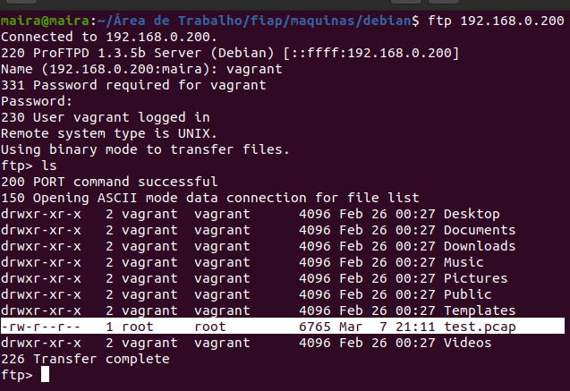
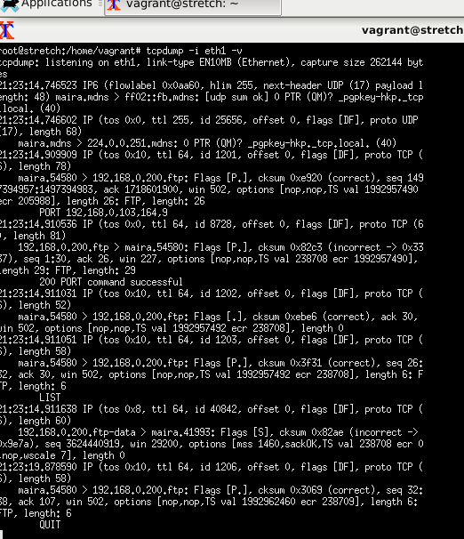
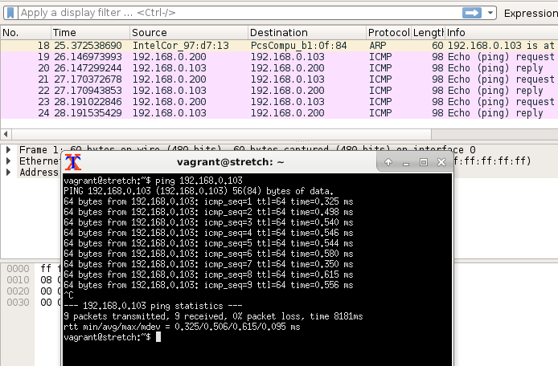
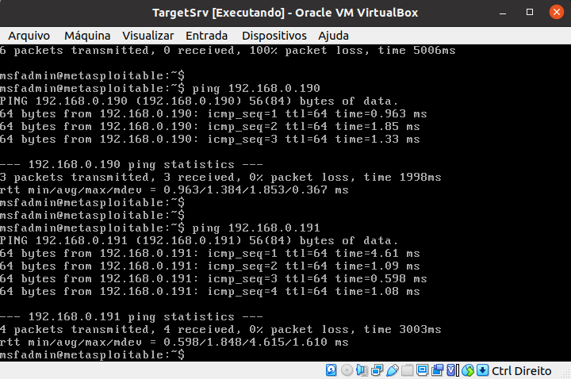
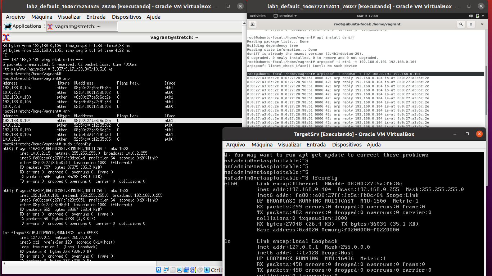

# Estudos sobre CYBERSECURITY.

Todo conteúdo é com base no curso CYBERSECURITY da fiap.
```html
https://on.fiap.com.br
```
# CAPITULO 1

## Definições.

Cybersecurity abrange um conjunto de normas, procedimento e boas práticas, que ajudam na identificação e mitigação de riscos relacionados a exposições na internet.  

## Vetores de ataque.

Vetor é o motivação ou o meio em qual ocorreu o ataque, os principais são listados a seguir.

## Principais Incidentes Reportados.


- PHISHING: email ou informação falsa compartilhada por meio digital. Maneira de atrair o alvo.

- WORM: atividades maliciosas relacionadas com processo automatizado da propagação de códigos maliciosos na rede.

- BRUTE FORCE: teste de varias possiveis senhas para acesso as credenciais do usuario.

- Dos: Denial of Service, onde o atacante utiliza um computador ou um conjunto de computadores para tirar de operação um serviço, computador ou rede.

- Invasão: Um ataque por acesso não autorizado a um computador ou rede.

- WEB: Ataque que compromete servidores web ou desconfigura páginas web.

- SCAN: analise da rede, por varredura de portas para identificar potenciais alvos.

- FRAUDE: qualquer ato de má fé com o objetivo de lesar ou ludibriar alguem. Enganar.


## Processos Internos.

Todo o levantamento de ativos da empresa para mapeamento de informações é muito importante. Impactando diretamente em processos internos específicos e simples da empresa, como quem tem acesso a informação, a necessidade daquele acesso para tal, o privilegio de acesso do usuario e a politica de segurança que a empresa propaga para evitar ou até mitigar riscos, tratando não apenas os efeitos mas as causas que levaram ao ataque.


# CAPITULO 2

## Segurança da Informação.

Definir a segurança da informação em uma só coisa é complicado, digamos que não se resume somente a equipamentos tecnologicos mas tambem processos, pessoas, ferramentas e documentos que regem toda uma area de mercado vasta.

> A segurança da informação pode ser definida como a proteção da informação contra diferentes tipos de ameaças, com o objetivo de garantir a continuidade do negócio, minimizar os riscos aos quais este possa vir a ser exposto. (ISO/IEC 27002:2005)

> A referida proteção da informação pode ser inicialmente entendida como a preservação da confidencialidade, integridade e disponibilidade da informação, essas propriedades complementadas a autenticidade, responsabilidade, não repúdio e confiabilidade, tornam completos todos os pilares da segurança da informação. (ISO/IEC 27001:2005)


**If you think technology can solve your security problems, then you don't understand the problems and you don't understand the technology.**

Não se investe em segurança da informação calculando o retorno (ROI- Return Over Investment), mas sim em quanto se consegue economizar, minimizando os riscos aos quais os ativos da organização possam vir a ser expostos, sem obter benefícios, então dá-se ao negocio o calculo de quanto o investimento pode evitar a perda de dinheiro.

### CID (confidencialidade, integridade e disponibilidade).

Três pilares básicos da Segurança da Informação.

- Confidencialidade: significa que esta acessível unicamente aos que tem autorização para isso.

- Integridade: garante exatidão e plenitude da informação, oque ão garante alterações ao longo do ciclo de vida da informação mas sim as que sejam legítimas.

- Disponibilidade: deve estar acessível a informação quando necessária, aos que tiverem autorização para isso.


### Privilégios minimos (Least Privilege)

A segurança da informação envolve muitos processos, entre os citados a **manutenção de privilégios mínimos** é o enfoque deste capitulo, que é a garantia de que um usuario comum não tenha privilégios semelhantes ao de um administrador.


### Defesa em profundidade (Defense in depth)

A defesa em profundidade é a implementação de um sistema defensivo em forma de camadas, onde varios mecanismos se complementam promovendo o sistema como um todo. 


### Principio da simplicidade (KISS - Keep it Sample, Stupid)

Um principio de que não se deve complitar a situação, que seja sucinto e simples. 

É necessario sempre partir de um script, o ponto inicial para configurações de firewalls ou redes. 

### Segregações de funções. (Separation of duties - SoD)

Método clássico para resolução de conflitos com o foco de previnir fraudes, sempre fazendo com que mais uma pessoa seja necessária para conclusão de uma tarefa. 

> "Implementar uma separação de papéis e responsabilidades que reduza a possibilidade de um único individuo 


# CAPITULO 3
## Riscos, vulnerabilidades e ameaças à segurança da informação e á continuidade de negócio. 

### Risco.

O termo RISCO é definido como qualquer evento que possa ter impacto (negativo) sobre a capacidade do serviço.

### Ameaças.

>Ameaças são definidas como a causa potencial de um incidente indesejado, que pode resultar em dano para um sistema ou para a organização.ISO/IEC13335-1:2004

### Vulnerabilidades

É definida uma vulnerabilidade como uma fraqueza em um sistema, deixando suscetíveis a incontáveis atividades que poderão causar perdas ou danos. 

## CVE (Common Vulnerability and Exposures).

Site especializado que padroniza as vulnerabilidades, fornecendo metricas, descrições e informações sobre vulnerabilidades ou exposições de informações de softwares por meio de um numero. 


```html
https://cve.mitre.org/
```
## Ataques e vetores de ataque.

Lembrando que um vetor de ataque é um caminho ou meio utilizado por um ser malicioso para obter acesso não autorizado, como um sistema ou dispositivo. 

- Ataques via browser; (20%) Violaçã por meio de navegador. 
- Ataques por força bruta; (20%) Teste de tentativa e erro.
- Ataques de negação de serviço; (15%) Ataques de sobrecarga de serviço.
- Ataques por worms; (13%) código malicioso que se auto-propaga. 
- Ataques por malwares; (10%) Código malicioso criado para prejudicar, sequestrar ou espionar. 
- Ataques web; (4%) SQL Injection, ataque direcionado a serviços web.
- Varreduras (scan attacks); (4%) Analise de portas abertas. hosts 
- Insiders. (14%) ataques realizado por um objetivo,planejamento e normalmente bem orquestrados. 

#### IDS (Sistema de identificação de intrusos)

## Controles para mitigação de riscos cibernéticos. 

CIS - Center Internet Security (Centro de estudos sobre segurança da internet), onde há um guia de adequação de controles de mitigação de riscos. Com 20 implementações sugestivas.

```html
https://www.cisecurity.org/
```

As principais implementações sugeridas pela CIS são:

- Inventário de dispositivos autorizados e não autorizados.
- Inventário de softwares autorizados e não autorizados.
- Implementação e gerenciamento da configuração segura dos ativos.
- Processos para avaliação e remediação continuada de vulnerabilidades. 
- Uso apropriado de privilégios administrativos.

Uma boa ferramenta para **inventário** é a **OCS inventory**, disponivel em:

```html
https://ocsinventory-ng.org/?lang=en 
```
> Desde 2001, o OCS Inventory procura tornar o inventário de hardware e software de computadores mais eficiente. O OCS Inventory consulta seus agentes para conhecer a composição soft e hard de cada máquina, de cada servidor.

Tambem se torna importante adquirir um SCAP (Security Content Automation Protocol), com maior dificuldade de aplicação, se torna vantajoso para auxiliar no planejamento e execução de varreduras de vulnerabilidades de forma automatizada e periodica. 

# CAPITULO 4

## TCP/IP: principais caracteristicas, funcionamento e vulnerabilidade.

#### Arpanet 

Em 1969 a Advanced Research Projects Agency (ARPA) desenvolveu uma rede experimental comutada por pacotes, chamada arpanet, estudando a comunicação de dados de forma segura. 

#### TCP/IP


A suíte de protocolos TCP/IP é baseada em
um modelo (de rede) com quatro camadas, diferente do modelo OSI que possui sete camadas – são diferentes.
O TCP foi adotado como padrão militar em 1983.

Modelo OSI | Modelo TCP/IP
:-----------:|:-----------------:
Aplicação | Aplicação: abrange as camadas de SESSÃO, APRESENTAÇÃO e APLICAÇÃO do modelo OSI.
Apresentação | 
Sessão | 
Transporte | Transporte: equivale à camada de TRANSPORTE do modelo OSI.
Rede | Internet: equivale à camada de REDES do modelo OSI.
Enlace | Acesso à rede: também algumas vezes referenciada simplesmente como camada de REDE, abrange as camadas FÍSICA e de Enlace do modelo OSI.
Física | 


#### Cabeçalho IPV4
Campo | Responsabilidade 
:-------------: | :-------------------------------------:
Version | Versão : Onde se define se é um ipv6 ou ipv4.
Protocol | Ip protocol. 1 ICMP, 2 IGMP, 6 TCP, 17 UDP.
Fragment Offset | Fragmentação de pacotes,  campo de 13 bits.
IP Flags | Dont Fragment or M More fragments follow.
Header Length | campo de 4 btis 
Total Length | campo de 16 bits 
Header Checksum | Campo que verifica a consistência do cabeçalho. 
RFC 791 | Internet Protocol 


#### Protocolo ICMP (Internet Control Message Protocol).

Usado para troca de diferente tipos de informação entre dispositivos IP em uma inter-rede. 


O corpo do comando PING funciona no seguinte padrão com o protocolo ICMP. 
Campo | Função
 :-------------:|:--------------------------------------------:|
 Type | campo com 8 bits que identifica o tipo de mensagem.
 Code | campo com 8 bits que identifica o subtipo da mensagem.
 Checksum | campo com 16 bits para verificar a consistência da mensagem. 
 Message Body | campo de tamanha variavel destinado a mensagens de erro ou informação.
 
#### TCP/IP: camada de transporte.

A camada de transporte  é a responsavel pela comunicação entre processos finais. Ou seja de ponta a ponta. a entrega fim-a-fim não se limita apenas à entrega da mensagem de um computador a outro, mas também de um processo específico no computador de origem a um processo específico no computador de
destino.

- TCP: (Transmistion Control Protocol) protocolo de comunicação confiavel e seguro que garante a entrega da mensagem, pois possui confirmação de recebimento, é orientado à conexão.

Estado do TCP | Significado
:------------:|:-----------------------------------------------:
CLOSED	| condição que não há conexão entre dispositivo
LISTEN | um dispositivo aguarda uma mensagem de sincronização.
SYS-SENT | após a mensagem de sincronização este aguardando resposta do outro dispositivo.
ESTABLISHED |  ambos os dispositivos receberam uma solicitação de conexão.
CLOSE WAIT | um dos dispositivos recebeu do outro um pedido de encerramento da conexão.
LAST ACK | o dispositivo que recebeu o pedido de encerramento e já o confirmou enviou seu próprio FIN e está aguardando um ACK para sua requisição.
FIN WAIT | um dispositivo neste estado está aguardando um ACK para um FIN que enviou ou aguarda por uma solicitação de finalização de conexão originada pelo outro dispositivo.
CLOSING | o dispositivo recebeu um FIN do outro dispositivo e enviou a ele um ACK, mas ainda não recebeu um ACK para sua própria mensagem FIN.
- UDP (User Datagram Protocol) protocolo simples, utilizado para transporte de pacotes sem conexão, não requer confirmação de recebimento.

## TCP/IP: camada de aplicação.

É a camada onde existe aplicações ouvindo para dispor de serviços, estão ligadas a protocolos.


APLICAÇÃO | TRANSPORTE | PORTA | DESCRIÇÃO 
:-----:|:---------:|:---:|:--------------------------------------------:
SSH|TCP|22| Acesso remoto seguro (criptografado)
TELNET|TCP|23| Acesso remoto sem criptografia
SMTP|TCP|25|Transferencia de email entre servidor e cliente.
DNS|UDP/TCP|53| Resolução de nomes.
DHCP|UDP|67/68|Endereçamento dinâmico de hosts.
HTTP|TCP|80|Navegação web.
POP|TCP|110|Recebimento de emails.
NTP|UDP|123|Sincronização de relogios dos hosts em uma rede. 

Ferramenta: netstat: verifica o status da rede. 

# CAPITULO 5 - Hypervisor (Laboratorio).

## Instalação do Virtual Box.

O virtual Box é um Hypervisor destinado a criação e o gerenciamento de máquinas virtuais. 

Faça o download do pacote conforme seu sistema operacional local no site oficial:

```html
https://www.virtualbox.org/wiki/Downloads
```

Use o comando dentro da pasta que fez o Download do arquivo de instalação.

```bash
sudo dpkg -i nomedopacote.deb
```

Lembre-se da configuração se estiver usando linux.

```bash
sudo /sbin/vboxconfig
```


Não esqueça de instalar o extension pack.

## Instalação do Vagrant.

O curso orienta o download de uma iso de um debian, porem eu acho mais facil a criação de uma maquina com o vangrant. 

No site do vagrant selecione seu sistema operacional e instale a ferramenta.

```html
https://www.vagrantup.com/downloads 
```

Procure por debian stretch64, e em um diretorio novo no terminal, rode os comandos:

```bash
vagrant init debian/stretch64
vagrant up
```

Edite no Vagrantfile as informações:

>
```sh
config.vm.provider "virtualbox" do |vb|  # Display the VirtualBox GUI when booting the machine  vb.gui = true  # Customize the amount of memory on the VM vb.memory = "1024" end
```

Use o comando vagrant provision para subir as mudanças. 

# CAPITULO 6

## Análise de pacotes em redes TCP/IP.

São aplicativos que analisam o tráfego, os dados, os pacotes especificamente, com base em cada camadas do modelo OSI estudados anteriormente. 

- Verificar o tráfego gerado por protocolo.
- Verificar a existência de gargalos na rede. 
- Correlacionar eventos. 
- Detectar intrusões. 
- Implementar políticas de segurança. 


### FTP. 

FTP significa File Transfer Protocol, um termo em inglês cuja tradução é Protocolo de Transferência de Arquivos.


Estabelecedor de conexão via dispositivo entre usuário e servidor, por meio dele é possivel realizar a troca de dados, quando devidamente conectados, funcionando por meio de um programa que conecta dois agentes: 


- cliente: quem solicita o acesso aos dados; 
- servidor: armazenador de informações.

Para instalar o vsFTPD no debian, no terminal, use o comando :
```bash
apt-get install -y vsftpd
```

Verifique se o serviço esta ativo com o comando:
```bash
sudo systemctl status vsftpd
```

Use o ftp da seguinte forma:

```bash
ftp 192.168.0.200
```


### TCP-DUMP. 

Monitoramento de rede, visualização por console ações que passam pela interface de rede. 


Para instalar em sua máquina use o comando:

```bash
sudo apt install tcpdump 
```

Atualize o repositorio.

```bash
sudo apt update 
sudo apt upgrade
```

Com o comando tcpdump -D é possivel visualizar as interfaces de rede ativas.

```bash
tcpdump -D
```
Para utilizar o tcpdump, lembrando que ele é via terminal, use o comando seguido pelo ip da máquina que esta na rede e deseja se conectar, lembre que o usuario e senha é do ip que deseja se conectar. 

```bash
tcpdump 192.168.0.101
```


E para setar qual interface deseja utilizar use o comando:

```bash
tcpdump -i eth1
```

Para ver oque esta sendo transmitido na rede no momento, use o parametro verbose -v :
```bash
tcpdump -i eth1 -v
```



Para mudar o nome de dominio para ip use o parametro -n:

```bash
tcpdump -i eth1 -n
```

Para armazenar os dados em um arquivo .pcap, use o parametro -w:

```bash
tcpdump -i eth1 -v -w nome.pcap 
```

### Wireshark 

O Wireshark, por sua vez, é um dos aplicativos mais completos e amplamente utilizados para análise de protocolos. Dispõe de interface gráfica simples e adequadamente configurável, sendo capaz de capturar os pacotes a serem analisados, ou extraí-los de arquivos no formato pcap, como os gerados pelo TCPDump.


```bash
sudo apt-get install wireshark 
```

Para capturar pacotes desta vez vamos utilizar o apache, porta 80:

```bash 
sudo apt install apache2
sudo service apache2 start
```

Depois inicialize o wireshark no terminal. 

```bash
wireshark
```

Inicie a captura na interface correta a esquerda.


Pingue do cliente ao servidor e verifique os pacotes sendo trocados por protocolo http.



# CAPITULO 7

## ATAQUES EM REDES TCP/IP.


- Ataques passivos ou de reconhecimento: são processos simples com o objetivo de coletar informações sobre sistemas e serviços em execução na rede. Senhas, servidores disponiveis, hashes de senha e enndereços IPS, são algumas das informações coletadas neste tipo de ataque. 

- Ataques ativos ou de comprometimento: são ataques que interferem no funcionamento dos sistemas e serviços, prejudicando usuarios ou dispositivos de rede. 

- Ataques de paralisação ou negação de serviço: são os que tem como foco desabilitar ou impedir o funcionamento do sistema que esta em produção. DoS (Denial of Service), ou DDoS (Distributed Denial of Service). 

### Simulando um ataque de Negação de serviço (DoS) com base no protocolo ARP Cache Poisoning. 

Este ataque ocorre quando um atacante manipula a tabela ARP do sistema alvo, ou seja altera as informações de destino dos pacotes. 

Eu usei o vagrant para criar duas máquinas, um debian e um ubuntu que são os clientes. Usei o metasploitable como servidor.

- lab1 (Ubuntu) - 192.168.0.198 CLIENTE ATACANTE
- lab2 (Debian) - 192.168.0.191 CLIENTE ALVO
- Metasploitable (Ubuntu)  - 192.168.0.104 SERVIDOR

### Criando um ubuntu com vagrant. 

Crie o diretorio lab1 baixe um arquivo de configuração de um ubuntu/focal64, com o comando:

```bash
mkdir lab1
vagrant init ubuntu/focal64
```

Antes de iniciar é interessante alterar o IP, dependendo da sua rede no Vagrantfile que agora há na pasta lab1.

Para ter uma interface gráfica descomente as linhas:

```ruby
 config.vm.provider "virtualbox" do |vb|
  #   # Display the VirtualBox GUI when booting the machine
     vb.gui = true
  #
  #   # Customize the amount of memory on the VM:
     vb.memory = "1024"
   end
   
```

Instale pelo shell as atualizações que deseja, descomente as linhas e adicione aplicativos.

```ruby
  config.vm.provision "shell", inline: <<-SHELL
     apt-get update
     apt-get install -y xfce4 firefox apache2 -y
   SHELL
end
```


### Testando a conectivadade das máquinas.

Com o servidor pingue as outras duas para verificar a comunicação.



Depois disso instale o dnsiff no atacante (Ubuntu) com os comandos :

```bash 
apt-get update
apt-get install -y dsniff
arp -na 
```
Teste o comando arp -na para verificar o atual mapeamento entre os endereços da rede. 

```bash
arp -na
```
Agora repare no mac atual do servidor Metasploitable quando recebe o ping do debian cliente, é um mac e depois do ataque de envenenamento de pacotes com o Ubuntu atacante, muda o mac do servidor tornando assim o atacante o emissor de pacotes. 


```bash
sudo arpsoof -i enpOs8 -t 192.168.0.191 192.168.0.104 
```

Repita o comando arp no debian. 




